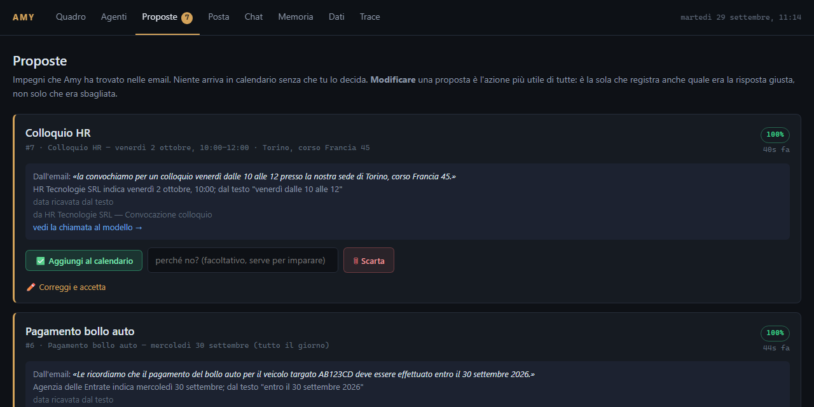

# Amy

A personal assistant that reads my email and keeps my calendar, running entirely on my own machine.




## What it is

Amy mirrors Gmail, Google Calendar and Google Tasks into a local SQLite database and works
on that copy. A local model (Qwen 3.5 9B, served by Ollama) sorts incoming mail and finds the
emails that contain a real commitment: an appointment, a hearing, a flight, a payment deadline.
Each one becomes a proposal that I accept or reject from Telegram or a small web dashboard.
Nothing reaches the calendar without that approval. I can also just talk to her ("when am I
free for two hours this week?", "move the dentist to Friday") and she answers from the mirror.

The interface and prompts are in Italian because I use it every day; the code and comments are
in English.

## Why it matters

An assistant with access to your inbox is useful only if you can trust it, and there are two
obvious ways to lose that trust. The first is sending your mail to a third party. The second
is writing wrong things into your calendar. Amy is built around avoiding both.

The first means no cloud APIs: there is no LLM key anywhere in the project, and the only network
traffic goes to Google (for my own data) and Telegram. The second means that the model never writes anything
directly. Creating, moving and deleting events all go through the same approval step.

Running locally makes the engineering harder. A 9B model on an 8 GB GPU is slow, and it is
unreliable at exactly the things an assistant needs: date arithmetic, choosing the right tool,
and saying "I don't know". Most of the design is about moving that work out of the model and
into code.

## Results

Measured on an RTX 3060 Ti (8 GB) and an i7-12700K, with `qwen3.5:9b` for every generative
task. Raw output is in [`results/`](results/).

| Check | Result | Mean latency |
|---|---|---|
| Email triage (category + signal) | 14 / 14 | 2,942 ms |
| Commitment extraction | 11 / 14 | 1,873 ms |
| Test suite (offline, no model or Google) | 284 passing | about 8 s total |

The evaluation set is small: 14 hand-written emails covering appointments, deadlines, flights,
newsletters with dates in them, and promotions pretending to be urgent. It is good at catching
regressions when a prompt changes, but it is not a benchmark.

The three extraction misses are all the same problem, and the model is not the cause. In each
case it found the right event and quoted the right date phrase. But the fixtures are anchored to
a fixed date (21 September 2026), while the check that discards past events uses the real clock.
Run a week later, "tomorrow at 14:30" is already in the past. The harness needs to freeze the
clock, and the set needs to grow. The corrections I make in the dashboard are already stored as
labelled examples (`amy/eval/dataset.py`), which is where the next set should come from.

One measurement changed the architecture. The original plan used three models: a 0.8B router,
a 2B worker and the 9B for conversation. With a second model loaded, Ollama quietly moved the
9B from the GPU to the CPU and it dropped from 57.8 to about 10 tokens per second. The 9B was
also the only one that triaged a hand-labelled set correctly (12/12, against 0/12 for the 2B on
the same prompt). So there is now one model for everything, with a separate prompt, output
schema and sampling settings per task.

## How it works

```
Gmail / Calendar / Tasks ──sync every 5 min──▶ SQLite mirror
                                                  │
                    triage ─▶ extract ─▶ resolve dates in code ─▶ proposal
                                                  │
                         Telegram / web dashboard ─▶ accept ─▶ Google Calendar
```

- **Sync.** Gmail syncs incrementally through `historyId`. Calendar re-lists a bounded window
  on each pass and reconciles, so deletions are always reflected; Tasks does a full re-list,
  since the lists are small. APScheduler runs the sync on background threads.
- **The model extracts, the code decides.** The model quotes the date phrase exactly as written.
  `dateparser` resolves it against the email's receipt time, and the model's own guess is only
  used as a cross-check. The same rule applies to free-time questions: the free slots are
  computed from the mirror and given to the model as facts.
- **Structured output everywhere.** Every call sends a JSON schema to Ollama, which compiles it
  into a sampling grammar. An invalid intent or a malformed proposal cannot be produced. When
  the model refuses to call a tool, the same request is asked again as a schema and the
  proposal is built in code.
- **Routing.** Regexes handle the common phrasings for free. Everything else goes to the model,
  which picks one of five narrow agents (schedule, inbox, tasks, proposals, briefing), each
  with only a few tools, because a small model chooses well among four tools and badly among
  fifteen. Anything that crosses domains goes to a general `chat` agent that has all of them.
- **Memory.** Recent conversation plus a rolling summary, and durable facts about the user
  retrieved by embedding similarity (`mxbai-embed-large`, on the CPU).
- **Tracing.** Every LLM call is stored with its exact prompt, raw response, model and
  latency. From a proposal on the dashboard you can go straight to the call that produced it.

Stack: Python 3.12, Ollama over plain `httpx`, SQLite, Pydantic, python-telegram-bot, FastAPI
with Jinja templates, and the Google API client.

## How to run it

You need Python 3.12+, [Ollama](https://ollama.com), a Google Cloud project with the Gmail,
Calendar and Tasks APIs enabled (and an OAuth **Desktop** client saved as `credentials.json` in
the project root), and a Telegram bot token from [@BotFather](https://t.me/BotFather).

```bash
git clone https://github.com/gpassoni/Amy.git
cd Amy
python -m venv .venv
source .venv/bin/activate          # Windows: .venv\Scripts\Activate.ps1
pip install -e ".[dev]"

ollama pull qwen3.5:9b
ollama pull mxbai-embed-large

cp .env.example .env               # set TELEGRAM_BOT_TOKEN
python -m amy auth                 # one-time Google consent in the browser
python -m amy doctor               # checks Ollama, the models, Google and the config
python main.py                     # bot + background sync + dashboard on http://127.0.0.1:8765
```

Send `/start` to the bot once; that binds it to your chat, and it ignores everyone else.

To try the pipeline without touching your real mailbox, point Amy at a separate database and
load the synthetic emails. That's how the screenshot above was made:

```bash
export DB_PATH=amy-demo.db         # PowerShell: $env:DB_PATH = "amy-demo.db"
python -m amy seed
python -m amy triage --no-labels
python -m amy extract
python -m amy proposals
python -m amy chat -v              # talk to her in the terminal; -v shows intent, agent and tools
```

`accept` still writes to your real Google Calendar, even on a demo database.

Tests need neither Ollama nor Google. The eval needs Ollama:

```bash
python -m pytest -q
python -m amy.eval.cli run
```

## Project structure

```
amy/
  agents/        router, the agents, their tools, prefetch and the structured fallback
  pipeline/      triage, commitment extraction, date resolution, accept/reject
  sync/          Gmail, Calendar and Tasks → SQLite, and the scheduler
  google/        API clients, OAuth, retry with backoff
  llm/           Ollama client, task → model registry, call tracing
  context/       prompt context and long-term memory
  store/         SQLite access and schema migrations
  interfaces/    Telegram bot, web dashboard, developer CLI
  eval/          fixtures, eval harness, correction → training-data export
tests/           284 offline tests
results/         eval output
main.py          entry point
```

## Next steps

The eval needs a frozen clock and a larger set built from real corrections. After that, the
plan is a LoRA adapter per task on the same base model, trained on the corrections the
dashboard already collects.
